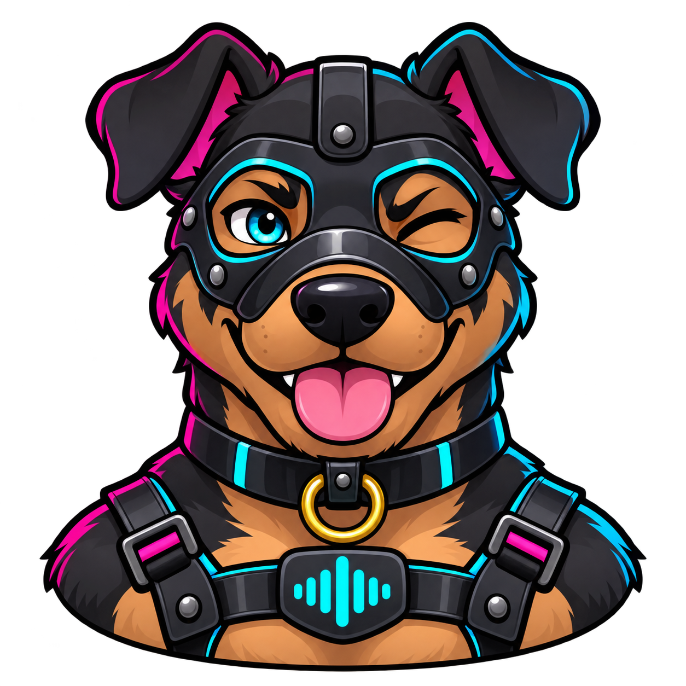

# Talkpuppy



Offline speech-to-clipboard for Android and iOS. Tap, speak, tap again — the
transcript is already in your clipboard, ready to paste into any app.

- **Fully on-device**: speech recognition runs locally with
  [sherpa-onnx](https://github.com/k2-fsa/sherpa-onnx). Audio never leaves the
  phone; the only network access is the one-time model download.
- **Choice of open-weights models**: NVIDIA Parakeet TDT 0.6B v3 (fast, 25
  European languages, automatic language detection) or OpenAI Whisper
  tiny/base/small (99 languages, language can be forced).
- **No friction**: one big record button, auto-copy after transcription,
  "continue recording" to append to the last text, re-transcribe with a
  different language or model.
- **Short-lived history**: recordings and transcripts are deleted
  automatically after 3 days (or manually), and excluded from iCloud/Android
  backups.

## Install

### Android (via Obtainium)

Add `https://github.com/thomaspietschmann/talkpuppy` in
[Obtainium](https://github.com/ImranR98/Obtainium). It picks the APK matching
your phone's architecture from the latest
[release](https://github.com/thomaspietschmann/talkpuppy/releases) and offers
updates automatically. You can also download the APK from the release page
directly (`arm64-v8a` for virtually all current phones).

### iOS

There is no App Store build. Build and install from a Mac with Xcode and a
(free) Apple developer account — see [Development](#development).

## Usage

1. On first launch pick a model; the app recommends one based on your phone's
   RAM. It is downloaded once (100–670 MB) and verified by checksum.
2. Tap the microphone, speak, tap again. The text appears and is copied.
3. "Weiter aufnehmen" appends another recording to the same text,
   "Neue Aufnahme" starts a fresh one.
4. Wrong language detected? Tap the translate icon to re-transcribe with a
   fixed language (requires a Whisper model).

## Privacy

- Audio is recorded to app-private storage and transcribed on the device.
- No analytics, no accounts, no server of our own.
- Network requests go only to Hugging Face (`huggingface.co`) to download the
  model files you choose. Hugging Face sees your IP address for that
  download; see their privacy policy.
- Recordings and transcripts are deleted after 3 days and are excluded from
  device backups.

## Third-party software and models

Talkpuppy builds on open-source software and openly licensed models. Their
license texts are shown in the app under *Einstellungen → Lizenzen*.

### Speech models (downloaded at runtime, not part of this repository)

The models are downloaded by the app from the
[csukuangfj](https://huggingface.co/csukuangfj) Hugging Face repositories,
which provide int8-quantized ONNX conversions for sherpa-onnx. The
conversions don't declare their own license; the licenses of the original
models apply:

| Model | Original | License |
|---|---|---|
| Parakeet TDT 0.6B v3 | [nvidia/parakeet-tdt-0.6b-v3](https://huggingface.co/nvidia/parakeet-tdt-0.6b-v3) | [CC BY 4.0](https://creativecommons.org/licenses/by/4.0/) — © NVIDIA Corporation |
| Whisper tiny / base / small | [openai/whisper](https://github.com/openai/whisper) | MIT (code and weights on GitHub; Apache-2.0 on the Hugging Face model cards) — © OpenAI |

CC BY 4.0 permits use, including commercial use, with attribution. Talkpuppy
does not modify the models beyond the upstream int8 conversion.

### Bundled with the app

| Component | Use | License |
|---|---|---|
| [Silero VAD](https://github.com/snakers4/silero-vad) (`assets/models/silero_vad.onnx`) | Splits long recordings at pauses | MIT — © Silero Team |
| [sherpa-onnx](https://github.com/k2-fsa/sherpa-onnx) | Speech recognition runtime | Apache-2.0 — © Xiaomi Corporation and contributors |
| [ONNX Runtime](https://github.com/microsoft/onnxruntime) (via sherpa-onnx) | Neural network inference | MIT — © Microsoft Corporation |
| [Flutter](https://flutter.dev) | App framework | BSD-3-Clause — © The Flutter Authors |
| Dart packages: `record`, `path_provider`, `shared_preferences`, `path`, `crypto`, `wakelock_plus` | Recording, storage, hashing, wakelock | BSD-3-Clause |
| Dart packages: `dio`, `cupertino_icons` | HTTP downloads, icons | MIT |

All of these licenses allow redistribution in source and binary form as long
as the copyright notices and license texts are preserved, which the in-app
license page does (Flutter collects the package licenses automatically; the
model licenses are registered in `lib/licenses.dart`).

### Talkpuppy itself

No license has been chosen for Talkpuppy's own code yet, so default copyright
applies: you may read it, but reuse requires permission.

## Development

```bash
flutter pub get
flutter analyze
flutter test
```

### Releases

CI/CD runs on GitHub (`.github/workflows/`):

- **CI** on every push to `main`: analyze and tests
- **Release** on a `v*` tag: signed APKs (one per CPU architecture) attached
  to a GitHub Release

```bash
git tag v0.0.3 && git push origin v0.0.3
```

The version name comes from the tag; the versionCode is derived from it
(`major*10000 + minor*100 + patch`), so tags must keep increasing.

### Android signing

Signed with `~/Keystores/talkpuppy-release.keystore` (alias and passwords in
`talkpuppy-release.properties` next to it — **keep a backup, a lost key means
reinstalling the app**). Locally `android/key.properties` (gitignored) is a
copy of that properties file; CI gets it through the secrets
`SIGNING_KEYSTORE_B64`, `SIGNING_STORE_PASSWORD`, `SIGNING_KEY_ALIAS`,
`SIGNING_KEY_PASSWORD`.

### iOS

Set your Apple team in `ios/Flutter/Debug.xcconfig` and `Release.xcconfig`
(`DEVELOPMENT_TEAM`), then:

```bash
flutter build ios --release
xcrun devicectl device install app --device <udid> build/ios/iphoneos/Runner.app
```

Builds signed with a free Apple team stop launching after 7 days and need
reinstalling.
