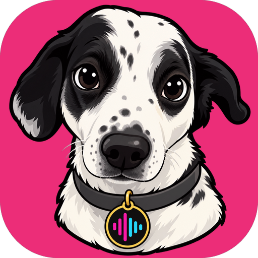

# Talkpuppy



Offline speech-to-clipboard for Android and iOS. Tap, speak, tap again — the
transcript is already in your clipboard, ready to paste into any app.

- **Fully on-device**: speech recognition runs locally with
  [sherpa-onnx](https://github.com/k2-fsa/sherpa-onnx). Audio never leaves the
  phone; the only network access is the one-time model download.
- **Choice of open-weights models**, from live preview to "runs on any
  phone" — see [Models](#models).
- **No friction**: one big record button, auto-copy after transcription,
  "continue recording" to append to the last text, re-transcribe with a
  different language or model.
- **Dictate into any app (Android)**: a floating record button over other
  apps inserts the transcript right at the cursor — see
  [Floating button](#floating-button-android).
- **Short-lived history**: recordings and transcripts are deleted
  automatically after 3 days (or manually), and excluded from iCloud/Android
  backups.
- **39 UI languages**: follows the system language, can be changed in the
  settings.

## Models

Pick one on first launch and switch any time; several can be installed side
by side.

| Model | Download | Languages | Strengths | Weaknesses |
|---|---|---|---|---|
| Parakeet TDT 0.6B v3 (NVIDIA) | ~640 MB | 25 European, detected automatically | Very accurate and fast | Text only after you stop; language can't be fixed; needs ≥ 6 GB RAM |
| Nemotron 3.5 ASR Streaming (NVIDIA) | ~650 MB | 28, detected automatically or fixed | Live preview while you speak, text ready right after stop | Usually a little less accurate than Parakeet; needs ≥ 6 GB RAM |
| Whisper Small (OpenAI) | ~360 MB | 99, detected automatically or fixed | Most languages, good accuracy | Slower; can occasionally make up words on silence or noise; ≥ 4 GB RAM |
| Whisper Base (OpenAI) | ~150 MB | 99 | Small download for older phones | Noticeably less accurate than Small; ≥ 3 GB RAM |
| Whisper Tiny (OpenAI) | ~100 MB | 99 | Smallest and fastest, runs on practically any phone | Least accurate; best for short, clearly spoken notes |

## Install

### Android (via Obtainium)

Add `https://github.com/thomaspietschmann/talkpuppy` in
[Obtainium](https://github.com/ImranR98/Obtainium). It picks the APK matching
your phone's architecture from the latest
[release](https://github.com/thomaspietschmann/talkpuppy/releases) and offers
updates automatically. You can also download the APK from the release page
directly (`arm64-v8a` for virtually all current phones).

### iOS

There is no App Store build. Build and install from a Mac with Xcode and a
(free) Apple developer account — see [Development](#development).

## Usage

1. On first launch pick a model; the app recommends one based on your phone's
   RAM. It is downloaded once (100–650 MB) and verified by checksum.
2. Tap the microphone, speak, tap again. The text appears and is copied.
   With Nemotron the text already shows up while you speak; after stop the
   microphone runs for another 0.7 s so the last word isn't cut off.
3. "Keep recording" appends another recording to the same text,
   "New recording" starts a fresh one.
4. Wrong language detected? Tap the translate icon to re-transcribe with a
   fixed language (requires a Whisper or Nemotron model).

## Floating button (Android)

Dictate straight into any text field, in any app:

1. In Talkpuppy, tap **Minimize and show overlay**. The first time, turn on
   the Talkpuppy accessibility service in the system settings (if the switch
   is greyed out because the app was installed from a browser: App info →
   ⋮ → *Allow restricted settings*). The app then goes to the background and
   the floating button appears over your other apps.
2. Put the cursor in a text field, tap the button, speak, tap again. The
   text is inserted at the cursor, with a space in front or after where a
   word touches it. A call or alarm ends the dictation and inserts what was
   said so far; holding the button during a recording cancels it.
3. While Talkpuppy itself is open the button stays, greyed out; it becomes
   active again as soon as you leave the app. To close it, drag it onto the
   ✕ at the bottom of the screen.

The button uses the model and language set in the app, and the app's
already loaded model (app and button share one engine), so a tap records
right away. If Android shows a Talkpuppy icon pinned to the screen edge,
that's the system's accessibility “Shortcut” for the service; it isn't
needed, and the app points to where to turn it off.

How the text gets in: on Android 13+ the accessibility service types into
the field like a keyboard (your keyboard stays active); on older versions
it sets the field's text, or pastes it in browsers and password fields. If
none of that works (a field that doesn't accept text from outside), the
text is put on the clipboard and the button says so.

## Privacy

- Audio is recorded to app-private storage and transcribed on the device.
- No analytics, no accounts, no server of our own.
- Network requests go only to Hugging Face (`huggingface.co`) to download the
  model files you choose. Hugging Face sees your IP address for that
  download; see their privacy policy.
- Recordings and transcripts are deleted after 3 days (checked at start and
  whenever the app returns to the foreground) and are excluded from device
  backups; downloaded models are never backed up either.
- The floating button's accessibility service only reads the text field
  you're typing in, and only to insert the dictation; it doesn't read other
  screen content, stores nothing from other apps and logs nothing. Its
  recordings go to the app's cache and are deleted right after
  transcription.
- Transcripts copied to the clipboard are marked sensitive: Android 13+
  hides them from the clipboard preview and clipboard sync, iOS keeps them
  local (no Universal Clipboard to your other devices). Turn off
  "Copy automatically" if you'd rather copy by hand.

## Third-party software and models

Talkpuppy builds on open-source software and openly licensed models. Their
licenses are summarized in the app under *Settings → Licenses*, with the
full license texts one tap further.

### Speech models (downloaded at runtime, not part of this repository)

The models are downloaded by the app from the
[csukuangfj](https://huggingface.co/csukuangfj) and
[csukuangfj2](https://huggingface.co/csukuangfj2) Hugging Face repositories,
which provide int8-quantized ONNX conversions for sherpa-onnx. The
conversions don't declare their own license; the licenses of the original
models apply:

| Model | Original | License |
|---|---|---|
| Parakeet TDT 0.6B v3 | [nvidia/parakeet-tdt-0.6b-v3](https://huggingface.co/nvidia/parakeet-tdt-0.6b-v3) | [CC BY 4.0](https://creativecommons.org/licenses/by/4.0/) — © NVIDIA Corporation |
| Nemotron 3.5 ASR Streaming 0.6B | [nvidia/nemotron-3.5-asr-streaming-0.6b](https://huggingface.co/nvidia/nemotron-3.5-asr-streaming-0.6b) | [OpenMDW-1.1](https://openmdw.ai/license/1-1) — © NVIDIA Corporation |
| Whisper tiny / base / small | [openai/whisper](https://github.com/openai/whisper) | MIT (code and weights on GitHub; Apache-2.0 on the Hugging Face model cards) — © OpenAI |

CC BY 4.0 and OpenMDW-1.1 permit use, including commercial use, with
attribution. Talkpuppy does not modify the models beyond the upstream int8
conversion.

### Bundled with the app

| Component | Use | License |
|---|---|---|
| [Silero VAD](https://github.com/snakers4/silero-vad) (`assets/models/silero_vad.onnx`) | Splits long recordings at pauses (offline models) | MIT — © Silero Team |
| [sherpa-onnx](https://github.com/k2-fsa/sherpa-onnx) | Speech recognition runtime | Apache-2.0 — © Xiaomi Corporation and contributors |
| [ONNX Runtime](https://github.com/microsoft/onnxruntime) (via sherpa-onnx) | Neural network inference | MIT — © Microsoft Corporation |
| [Flutter](https://flutter.dev) | App framework | BSD-3-Clause — © The Flutter Authors |
| Dart packages: `record`, `path_provider`, `shared_preferences`, `path`, `crypto`, `wakelock_plus` | Recording, storage, hashing, wakelock | BSD-3-Clause |
| Dart packages: `dio`, `cupertino_icons` | HTTP downloads, icons | MIT |

All of these licenses allow redistribution in source and binary form as long
as the copyright notices and license texts are preserved, which the in-app
license page does (Flutter collects the package licenses automatically; the
model licenses are registered in `lib/licenses.dart`).

### Talkpuppy itself

No license has been chosen for Talkpuppy's own code yet, so default copyright
applies: you may read it, but reuse requires permission.

## Development

```bash
flutter pub get
flutter analyze
flutter test
```

### End-to-end tests

UI flows run with [Maestro](https://maestro.dev) on an emulator/simulator:

```bash
tool/e2e_android.sh            # Android emulator: full setup incl. permissions
                               # and accessibility service, floating button,
                               # insertion, calls, rotation, process death, …
maestro test .maestro/ios      # iOS simulator: onboarding, settings, licenses,
                               # denied microphone
```

The Android script resets Talkpuppy's data on the emulator and uses the
debug APK, whose `DebugInsertReceiver` triggers insertion without a
microphone. Emulators/simulators record silence (or no audio at all on the
iOS simulator), so real speech is tested on devices.

### Releases

CI/CD runs on GitHub (`.github/workflows/`):

- **CI** on every push to `main`: analyze and tests
- **Release** on a `v*` tag: signed APKs (one per CPU architecture) attached
  to a GitHub Release

```bash
git tag vX.Y.Z && git push origin vX.Y.Z
```

The version name comes from the tag; the versionCode is derived from it
(`major*10000 + minor*100 + patch`), so tags must keep increasing.

### Android signing

Signed with `~/Keystores/talkpuppy-release.keystore` (alias and passwords in
`talkpuppy-release.properties` next to it — **keep a backup, a lost key means
reinstalling the app**). Locally `android/key.properties` (gitignored) is a
copy of that properties file; CI gets it through the secrets
`SIGNING_KEYSTORE_B64`, `SIGNING_STORE_PASSWORD`, `SIGNING_KEY_ALIAS`,
`SIGNING_KEY_PASSWORD`.

### iOS

Set your Apple team in `ios/Flutter/Debug.xcconfig` and `Release.xcconfig`
(`DEVELOPMENT_TEAM`), then:

```bash
flutter build ios --release
xcrun devicectl device install app --device <udid> build/ios/iphoneos/Runner.app
```

Builds signed with a free Apple team stop launching after 7 days and need
reinstalling.
